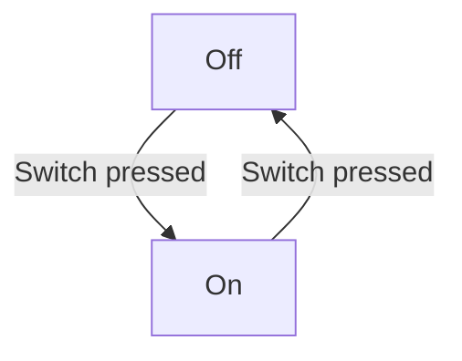

# Integrating with GitHub

## Displaying Diagrams using PlantUML

TODO


## Display Diagram using draw.io

draw.io diagrams are just SVG, so they work on webpages out of the box!

Upload your images to GitHub and using markdown to render them, eg. 

```
  
```


## Generating code on commit using StateSmith GitHub Actions

TODO


## Displaying Diagrams using Mermaid

> [!NOTE]
> StateSmith does not natively support Mermaid. If you use mermaid diagrams in your docs
> you will need to find another way to keep them in sync with your code. We recommend
> one of the other diagramming solutions for GitHub, such as PlantUML or draw.io above.

GitHub Markdown has native support for Mermaid. Mermaid's Flowchart diagrams offer a close approximation 
to state diagrams and can represent many or most of what you might want to achieve in your state machines.


These diagrams will display properly in your README.md and other markdown files when viewed on GitHub.

#### GitHub Pages

By default, GitHub Pages do not natively display Mermaid diagrams. But you can customize the template
used to generate your pages to add Mermaid rendering. Stackoverflow has suggestions on how to do this.
