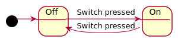

# Generating JavaScript State Machines

This tutorial will walk you through how to generate JavaScript source code for a simple state machine. Even if you don't intend to build JavaScript apps, this tutorial is a great way to get started with StateSmith because it will show you how to generate an interactive simulator for your state machines that can be viewed in a web browser.


## Prerequisites

We recommend completing the following sections before proceeding with this tutorial:
* [Quickstart](docs/quickstart/quickstart.md)

## Adding event handling to your state machine

We will want to be able to execute some code whenever the state machine changes state, so let's add some
event handling to the `Off` and `On` states.

Update your lightbulb state machine to look like the following:

<table>
<tr>
<td>

</td>
<td>
<pre>

</pre>
</td>
</tr>
</table>

You can see what the new states look like in the simulator.

<iframe height="300" width="600" src="https://emmby.github.io/statesmith-simplified/languages/lightbulb.sim.html"></iframe>


It looks like the state machine is doing what we want. Let's go write some code to use our new state machine.

## Using the State Machine in your own app

To use the state machine you created in Quickstart, you'll create a simple html page that loads and uses the state machine.
This page will:
  1. Implement the `enter_on()` and `enter_off()` callbacks we defined in `lightbulb.puml`.
  3. Create a button that fires the `SWITCH` event.
  3. Creates and runs the state machine.

Create a new file called `myapp.html` and add the following

```html

```

Now open this `myapp.html` in your browser. Notice that the page updates every time you click the Switch button!

See this in action online with [myapp.html](myapp.html): [interactive demo](https://emmby.github.io/statesmith-simplified/languages/myapp.html)


