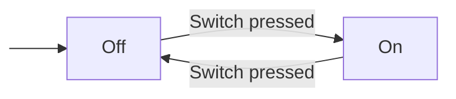

# Generating JavaScript

First create the state machine. We'll use PlantUML to get started quickly. Later you can try one of our other supported diagraming formats.

<table>
<tr>
<td>



</td>
<td>
<pre>
# light.puml
@startuml
[*] -> Off
Off -> On : Switch pressed
On -> Off : Switch pressed
@enduml
</pre>
</td>
</tr>
</table>


## Generate the JavaScript Code

Now run `statesmith` to generate code for this state machine.

```
% statesmith --lang=js light.puml
```

## View the State Machine

Open `light.html` in your browser.

TODO blah blah interact.

Take a look at the generated files on the disk.
* `light.html`: A simple simulator that runs your statemachine and allows you to interact with it.
* `light.js`: The generated JavaScript state machine. You can include this state machine in your JavaScript apps

TODO links to examples dir for light.html and light.js

## Using the State Machine in your own app

examine the js state machine

write an app that uses the state machine

```
<!-- myapp.html -->

xxx
```


