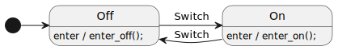

# Actions and Triggers

When an event is dispatched the state machine responds by performing actions, such as changing a variable, performing I/O, invoking a function, generating another event instance, or changing to another state.


## A Simple Example

<table>
<tr>
<td>

</td>
<td>
<pre>

</pre>
</td>
</tr>
</table>

<iframe height="300" width="600" src="https://emmby.github.io/statesmith-simplified/statemachine_reference/actions/lightbulb.sim.html"></iframe>


## Trigger and action syntax

The syntax for actions and triggers is:

`trigger / action`

TODO is this supported?

One or more can be nested inside a block:

```
{
    trigger / action
}
```

## Supported Triggers

StateSmith supports the following triggers:
* `entry`
* `exit`
* user-defined events (learn more in the Events tutorial)


## See Also 

See https://en.wikipedia.org/wiki/UML_state_machine for a reference on state machine grammar. Not all features may be supported by StateSmith.


